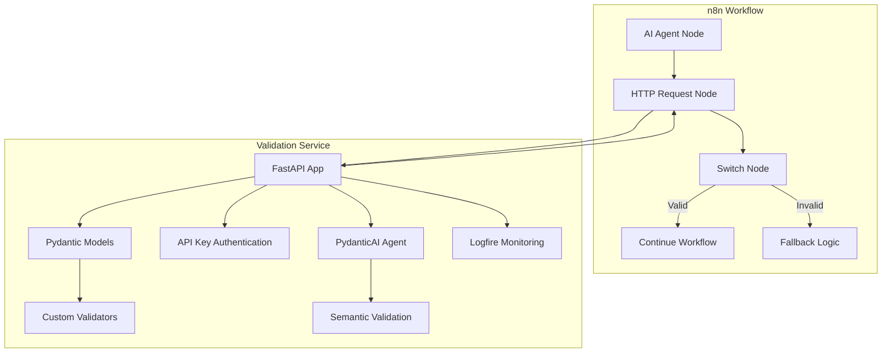
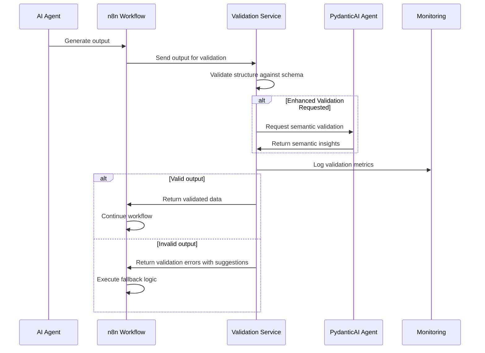
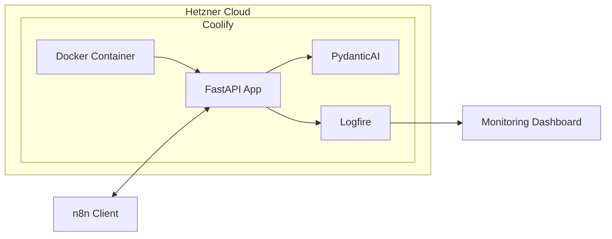
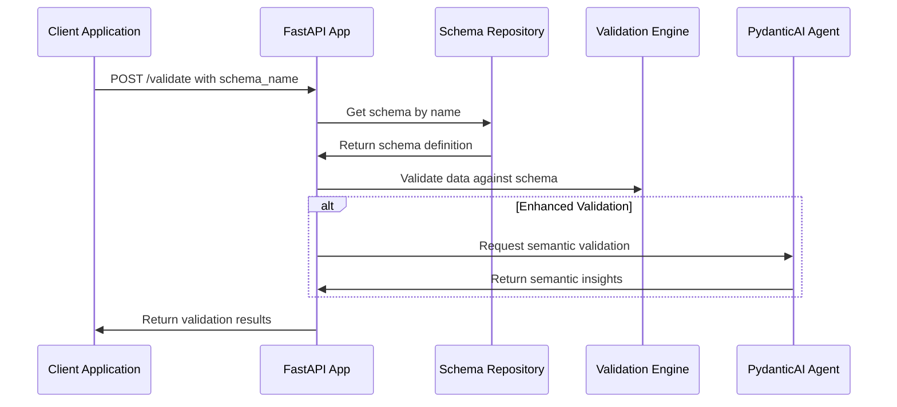

# AI Output Validation Service Master Plan

## Project Overview

This document outlines the master plan for implementing an AI Output Validation Service using FastAPI and Pydantic. The service will provide a dedicated validation endpoint for n8n workflows to validate AI agent outputs against predefined schemas.

### Project Goals

1. Implement a lightweight validation service with FastAPI and Pydantic v2
2. Deploy the service on Hetzner Cloud via Coolify
3. Create a seamless integration with n8n for AI agent output validation
4. Ensure data reliability with standardized validation patterns
5. Enhance validation capabilities with PydanticAI for semantic validation
6. Implement performance monitoring using Pydantic Logfire
7. Create a Schema Repository for storing and managing reusable validation schemas

## Architecture Design



### System Components

#### AI Validation Service (FastAPI)

- Validation endpoints for different AI output types
- Pydantic models for schema definition and validation
- API key authentication for security
- Error handling and standardized responses
- PydanticAI integration for enhanced semantic validation
- Logfire monitoring for performance metrics

#### n8n Integration

- HTTP request node for calling validation endpoints
- Switch node for handling validation results
- Fallback logic for handling invalid AI outputs

#### Deployment Infrastructure

- Hetzner Cloud server
- Coolify for container orchestration
- Docker container for the validation service

## Data Flow



## Technical Implementation

### Directory Structure

```
ai-validation-service/
├── app/
│   ├── main.py              # FastAPI application entry point
│   ├── models.py            # Pydantic models for validation
│   ├── auth.py              # Authentication utilities
│   ├── ai_agent.py          # PydanticAI integration
│   ├── monitoring.py        # Logfire configuration and metrics
│   ├── repository/          # Schema repository implementation
│   │   ├── __init__.py      # Repository package initialization
│   │   ├── models.py        # Schema repository models
│   │   ├── storage.py       # Storage implementation (file-based or database)
│   │   └── service.py       # Schema repository service layer
│   └── README.md                # Project documentation
```

### API Endpoints

| Endpoint | Method | Description | Authentication |
|----------|--------|-------------|----------------|
| `/validate/{validation_type}` | POST | Validates AI output against specified schema | API Key |
| `/enhance-validate/{validation_type}` | POST | Enhanced validation with semantic checks | API Key |
| `/health` | GET | Health check endpoint | None |
| `/monitoring` | GET | Validation performance metrics | API Key |
| `/schemas` | GET | List all available schemas | API Key |
| `/schemas` | POST | Create a new schema | API Key |
| `/schemas/{schema_name}` | GET | Get schema details | API Key |
| `/schemas/{schema_name}` | PUT | Update a schema | API Key |
| `/schemas/{schema_name}` | DELETE | Delete a schema | API Key |
| `/schemas/{schema_name}/versions` | GET | Get schema version history | API Key |
| `/schemas/{schema_name}/versions/{version}` | GET | Get specific schema version | API Key |

### Pydantic Models

#### Base Models

```python
# Example Pydantic model for generic AI outputs
class GenericAIOutput(BaseModel):
    response_text: str = Field(..., min_length=1)
    confidence_score: Optional[float] = Field(None, ge=0.0, le=1.0)
    
    model_config = {
        "str_strip_whitespace": True,
        "extra": "forbid"
    }
```

#### Enhanced Validation Models

```python
# Enhanced validation models with PydanticAI
class EnhancedValidationResult(BaseModel):
    is_structurally_valid: bool
    is_semantically_valid: bool
    semantic_score: float = Field(..., ge=0.0, le=1.0)
    suggestions: Optional[List[str]] = None
    enhanced_data: Optional[Dict[str, Any]] = None
```

#### Response Models

```python
# Standard response models
class ErrorResponse(BaseModel):
    status: Literal["invalid"] = "invalid"
    errors: List[Dict[str, Any]]

class SuccessResponse(BaseModel):
    status: Literal["valid"] = "valid"
    validated_data: Dict[str, Any]

class EnhancedResponse(BaseModel):
    standard_validation: Dict[str, Any]
    enhanced_validation: Dict[str, Any]
```

### PydanticAI Integration

```python
# Example PydanticAI agent configuration
from pydantic_ai import Agent

validation_agent = Agent(
    'openai:gpt-4o',
    system_prompt=(
        'You are a validation assistant that verifies AI outputs. '
        'You help determine if the output meets both structural and semantic requirements.'
    ),
    instrument=True,
)

async def enhance_validation(data, validation_type, validation_errors=None):
    """Use PydanticAI to enhance validation with semantic checks"""
    # Implementation details
```

### Monitoring Configuration

```python
# Example Logfire configuration
import logfire

def setup_monitoring():
    """Configure Logfire for monitoring validation performance"""
    logfire.configure(
        service_name="ai-validation-service",
        service_version="0.1.0",
    )
    logfire.instrument_pydantic()
```

## Deployment Architecture



### Deployment Steps

1. Set up Hetzner Cloud server
2. Install Coolify on the server
3. Push code to Git repository
4. Connect repository to Coolify
5. Configure deployment settings
6. Deploy the application

## n8n Integration Guide

### Setting Up the Workflow

1. Create a new n8n workflow
2. Add AI agent node (e.g., OpenAI)
3. Add HTTP Request node:
   - Method: POST
   - URL: `https://your-validation-service.com/validate/{validation_type}`
   - Headers: `x-api-key: your-api-key`
   - Body: AI agent output

### Enhanced Validation Example

For enhanced validation with semantic checks:
```json
{
  "nodes": [
    {
      "name": "AI Agent",
      "type": "n8n-nodes-base.openai",
      "parameters": {
        "prompt": "Generate product recommendations"
      }
    },
    {
      "name": "Enhanced Validate",
      "type": "n8n-nodes-base.httpRequest",
      "parameters": {
        "method": "POST",
        "url": "https://your-validation-service.com/enhance-validate/recommendation",
        "headers": {
          "x-api-key": "your-api-key"
        },
        "bodyContent": "={{$node[\"AI Agent\"].json}}"
      }
    },
    {
      "name": "Handle Result",
      "type": "n8n-nodes-base.switch",
      "parameters": {
        "rules": [
          {
            "condition": "={{$node[\"Enhanced Validate\"].json[\"standard_validation\"][\"status\"] === \"valid\" && $node[\"Enhanced Validate\"].json[\"enhanced_validation\"][\"is_semantically_valid\"] === true}}",
            "destination": "Continue Workflow"
          },
          {
            "condition": "={{$node[\"Enhanced Validate\"].json[\"standard_validation\"][\"status\"] === \"valid\" && $node[\"Enhanced Validate\"].json[\"enhanced_validation\"][\"is_semantically_valid\"] === false}}",
            "destination": "Review Semantic Issues"
          },
          {
            "condition": "={{$node[\"Enhanced Validate\"].json[\"standard_validation\"][\"status\"] === \"invalid\"}}",
            "destination": "Handle Invalid Data"
          }
        ]
      }
    }
  ]
}
```

## Implementation Notes

### FastAPI-Pydantic Integration

FastAPI works seamlessly with Pydantic v2, providing:

- **Automatic documentation**: Generates OpenAPI documentation from Pydantic models
- **Type validation**: Enforces type safety with runtime validation
- **Error handling**: Detailed error messages for validation failures

As stated in the FastAPI docs:
> With FastAPI, by using short, intuitive and standard Python type declarations, you get: editor support, data parsing, data validation, and API annotation and automatic documentation.

### PydanticAI Benefits

PydanticAI enhances the validation service with:

- **Semantic validation**: Goes beyond structural checks to validate meaning
- **Multi-model support**: Works with OpenAI, Anthropic, Gemini, and more
- **Type-safe agents**: Ensures validation consistency across runs
- **Streaming validation**: Process outputs as they're generated
- **Performance monitoring**: Track validation metrics with Logfire

According to PydanticAI docs:
> PydanticAI is a Python agent framework designed to make it less painful to build production grade applications with Generative AI.

### Security Best Practices

- Use API keys for authentication
- Store API keys in environment variables, not in code
- Implement rate limiting for production
- Use HTTPS for all communication
- Securely store LLM provider API keys

## Monitoring and Maintenance

### Health Checks

The `/health` endpoint allows monitoring the service's status:

```python
@app.get("/health")
async def health_check():
    return {"status": "healthy"}
```

### Performance Monitoring

- Use Logfire for comprehensive validation monitoring
- Track validation success rates and response times
- Monitor semantic validation accuracy
- Alert on validation error patterns

```python
@app.get("/monitoring")
async def get_validation_metrics(api_key: Depends(verify_api_key)):
    """Get metrics on validation performance"""
    # Implementation details
```

## Scaling Considerations

For higher loads, consider:

1. Horizontal scaling with multiple instances
2. Adding Redis for caching frequent validation schemas
3. Implementing database storage for validation results
4. Optimize LLM usage costs with batching and caching

## MVP Implementation Checklist

- [ ] Set up basic FastAPI application
- [ ] Implement Pydantic models for validation
- [ ] Add API key authentication
- [ ] Create validation endpoints
- [ ] Add health check endpoint
- [ ] Create Dockerfile
- [ ] Deploy to Hetzner via Coolify
- [ ] Test integration with n8n
- [ ] Document API endpoints
- [ ] Integrate PydanticAI for enhanced validation
- [ ] Configure Logfire for performance monitoring
- [ ] Add monitoring dashboard

## Future Enhancements

- Custom validation schema repository
- User management and multiple API keys
- Validation analytics and reporting
- WebSocket support for real-time validation
- AI feedback mechanism based on validation results
- Automated schema generation
- Error correction suggestions
- Multi-model validation comparisons

## References

1. [FastAPI Documentation](https://fastapi.tiangolo.com/)
2. [Pydantic Documentation](https://docs.pydantic.dev/latest/)
3. [n8n Documentation](https://docs.n8n.io/)
4. [Coolify Documentation](https://coolify.io/docs/)
5. [Hetzner Cloud Documentation](https://docs.hetzner.com/cloud/)
6. [PydanticAI Documentation](https://ai.pydantic.dev/)
7. [Pydantic Logfire Documentation](https://docs.logfire.dev/pydantic-logfire/)

## Schema Repository Implementation

### Schema Storage

The Schema Repository will initially use file-based storage with the following structure:

```
data/
├── schemas/
│   ├── schema1/
│   │   ├── 1.0.json
│   │   ├── 1.1.json
│   │   └── metadata.json
│   ├── schema2/
│   │   ├── 1.0.json
│   │   └── metadata.json
│   └── ...
```

In the future, this can be upgraded to use a database storage solution.

### Schema Models

```python
# Schema models for storage and API
class SchemaField(BaseModel):
    """Definition of a field in a validation schema"""
    type: str
    required: bool = False
    description: Optional[str] = None
    min_length: Optional[int] = None
    max_length: Optional[int] = None
    pattern: Optional[str] = None
    enum: Optional[List[Any]] = None
    gt: Optional[float] = None
    lt: Optional[float] = None
    items: Optional[Dict[str, Any]] = None
    
class SchemaDefinition(BaseModel):
    """Schema definition stored in the repository"""
    name: str
    description: str
    version: str
    created_at: datetime
    updated_at: datetime
    schema: Dict[str, SchemaField]
    validation_level: Literal["structure_only", "basic", "standard", "strict"]
    example: Optional[Dict[str, Any]] = None
```

### Validation Flow with Schema Repository



### Future Enhancements

- Schema categories/tags for better organization
- Schema sharing between organizations
- Schema validation statistics
- Schema suggestions based on data
- Automatic schema generation from sample data 