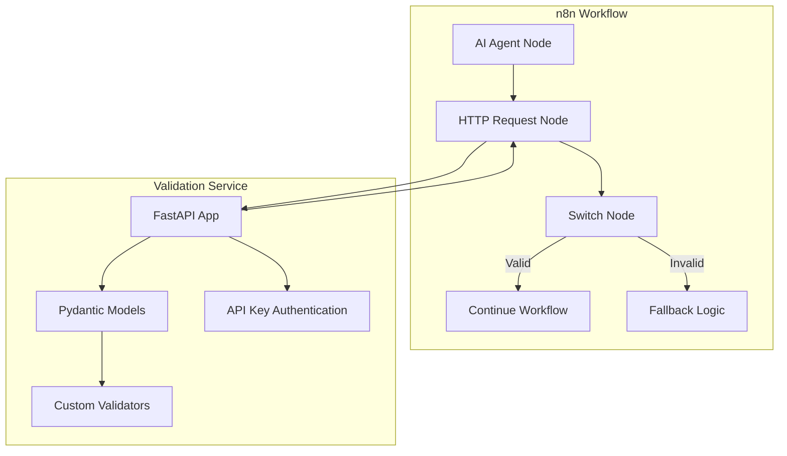
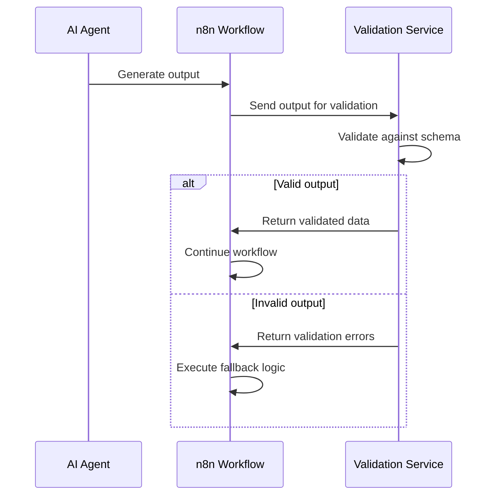
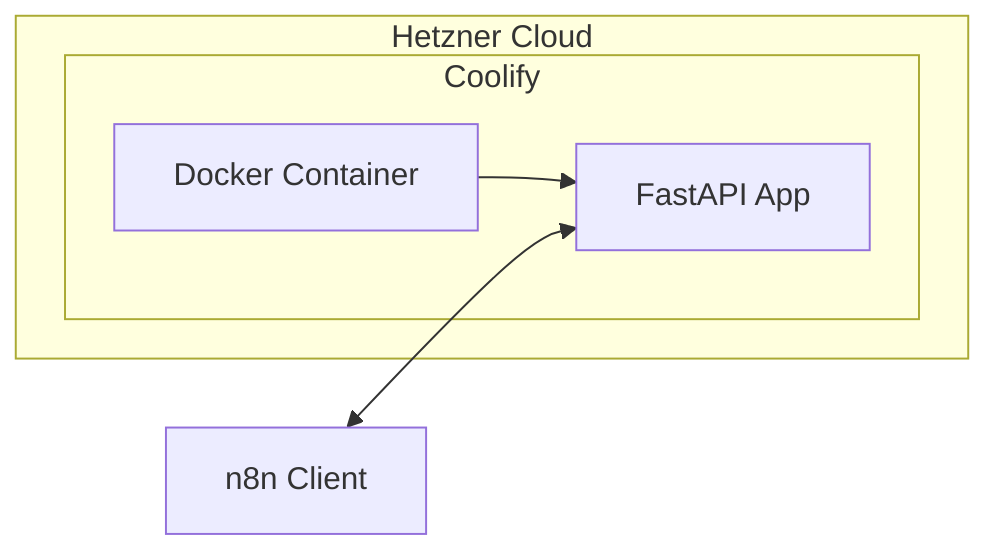

# AI Output Validation Service Master Plan

## Project Overview

This document outlines the master plan for implementing an AI Output Validation Service using FastAPI and Pydantic. The service will provide a dedicated validation endpoint for n8n workflows to validate AI agent outputs against predefined schemas.

### Project Goals

1. Implement a lightweight validation service with FastAPI and Pydantic v2
2. Deploy the service on Hetzner Cloud via Coolify
3. Create a seamless integration with n8n for AI agent output validation
4. Ensure data reliability with standardized validation patterns

## Architecture Design



### System Components

#### AI Validation Service (FastAPI)

- Validation endpoints for different AI output types
- Pydantic models for schema definition and validation
- API key authentication for security
- Error handling and standardized responses

#### n8n Integration

- HTTP request node for calling validation endpoints
- Switch node for handling validation results
- Fallback logic for handling invalid AI outputs

#### Deployment Infrastructure

- Hetzner Cloud server
- Coolify for container orchestration
- Docker container for the validation service

## Data Flow



## Technical Implementation

### Directory Structure

```
ai-validation-service/
├── app/
│   ├── main.py              # FastAPI application entry point
│   ├── models.py            # Pydantic models for validation
│   └── auth.py              # Authentication utilities
├── Dockerfile               # Container definition
├── requirements.txt         # Python dependencies
└── README.md                # Project documentation
```

### API Endpoints

| Endpoint | Method | Description | Authentication |
|----------|--------|-------------|----------------|
| `/validate/{validation_type}` | POST | Validates AI output against specified schema | API Key |
| `/health` | GET | Health check endpoint | None |

### Pydantic Models

#### Base Models

```python
# Example Pydantic model for generic AI outputs
class GenericAIOutput(BaseModel):
    response_text: str = Field(..., min_length=1)
    confidence_score: Optional[float] = Field(None, ge=0.0, le=1.0)
    
    model_config = {
        "str_strip_whitespace": True,
        "extra": "forbid"
    }
```

#### Response Models

```python
# Standard response models
class ErrorResponse(BaseModel):
    status: Literal["invalid"] = "invalid"
    errors: List[Dict[str, Any]]

class SuccessResponse(BaseModel):
    status: Literal["valid"] = "valid"
    validated_data: Dict[str, Any]
```

## Deployment Architecture



### Deployment Steps

1. Set up Hetzner Cloud server
2. Install Coolify on the server
3. Push code to Git repository
4. Connect repository to Coolify
5. Configure deployment settings
6. Deploy the application

## n8n Integration Guide

### Setting Up the Workflow

1. Create a new n8n workflow
2. Add AI agent node (e.g., OpenAI)
3. Add HTTP Request node:
   - Method: POST
   - URL: `https://your-validation-service.com/validate/{validation_type}`
   - Headers: `x-api-key: your-api-key`
   - Body: AI agent output

### Example n8n Configuration

```json
{
  "nodes": [
    {
      "name": "AI Agent",
      "type": "n8n-nodes-base.openai",
      "parameters": {
        "prompt": "Generate product recommendations"
      }
    },
    {
      "name": "Validate Output",
      "type": "n8n-nodes-base.httpRequest",
      "parameters": {
        "method": "POST",
        "url": "https://your-validation-service.com/validate/recommendation",
        "headers": {
          "x-api-key": "your-api-key"
        },
        "bodyContent": "={{$node[\"AI Agent\"].json}}"
      }
    },
    {
      "name": "Handle Result",
      "type": "n8n-nodes-base.switch",
      "parameters": {
        "rules": [
          {
            "condition": "={{$node[\"Validate Output\"].json[\"status\"] === \"valid\"}}",
            "destination": "Continue Workflow"
          },
          {
            "condition": "={{$node[\"Validate Output\"].json[\"status\"] === \"invalid\"}}",
            "destination": "Handle Invalid Data"
          }
        ]
      }
    }
  ]
}
```

## Implementation Notes

### FastAPI-Pydantic Integration

FastAPI works seamlessly with Pydantic v2, providing:

- **Automatic documentation**: Generates OpenAPI documentation from Pydantic models
- **Type validation**: Enforces type safety with runtime validation
- **Error handling**: Detailed error messages for validation failures

As stated in the FastAPI docs:
> With FastAPI, by using short, intuitive and standard Python type declarations, you get: editor support, data parsing, data validation, and API annotation and automatic documentation.

### Pydantic v2 Considerations

Pydantic v2 brings several improvements:

- **Performance**: Core validation written in Rust for faster processing
- **Strict/Lax modes**: Control how strict the validation should be
- **Schema generation**: Improved JSON Schema generation for documentation

According to Pydantic docs:
> Pydantic is the most widely used data validation library for Python. Fast and extensible, Pydantic plays nicely with your linters/IDE/brain.

### Security Best Practices

- Use API keys for authentication
- Store API keys in environment variables, not in code
- Implement rate limiting for production
- Use HTTPS for all communication

## Monitoring and Maintenance

### Health Checks

The `/health` endpoint allows monitoring the service's status:

```python
@app.get("/health")
async def health_check():
    return {"status": "healthy"}
```

### Error Monitoring

- Consider integrating Logfire for Pydantic validation monitoring
- Log validation errors for analysis and improvement

## Scaling Considerations

For higher loads, consider:

1. Horizontal scaling with multiple instances
2. Adding Redis for caching frequent validation schemas
3. Implementing database storage for validation results

## MVP Implementation Checklist

- [ ] Set up basic FastAPI application
- [ ] Implement Pydantic models for validation
- [ ] Add API key authentication
- [ ] Create validation endpoints
- [ ] Add health check endpoint
- [ ] Create Dockerfile
- [ ] Deploy to Hetzner via Coolify
- [ ] Test integration with n8n
- [ ] Document API endpoints

## Future Enhancements

- Custom validation schema repository
- User management and multiple API keys
- Validation analytics and reporting
- WebSocket support for real-time validation
- AI feedback mechanism based on validation results

## References

1. [FastAPI Documentation](https://fastapi.tiangolo.com/)
2. [Pydantic Documentation](https://docs.pydantic.dev/latest/)
3. [n8n Documentation](https://docs.n8n.io/)
4. [Coolify Documentation](https://coolify.io/docs/)
5. [Hetzner Cloud Documentation](https://docs.hetzner.com/cloud/) 